---
format:
  revealjs:
    progress: false
    theme: [default, styles.scss]
    include-after-body: progressor.html
    slideNumber: true
execute: 
  echo: false
  message: false
  warning: false
revealjs-plugins:
  - editable
filters:
  - editable
---

## PPG II、そしてその先へ：シダ植物におけるコミュニティ主導型分類体系の構築 {data-background-image="images/Picture1.png" data-background-size="contain" background-position="right" style="width: 50%; margin-left: -65px;"}

::: {style="width: 100%; font-size: 0.7em;"}
**ニッタジョエル*** (千葉大・院・国際)

Carl J. Rothfels (Utah State University)

Harald Schneider (Xishuangbanna Tropical Botanical Garden)

Eric Schuettpelz (Smithsonian<br>Institution)

:::: {.columns}

::: {.column width="50%"}
{height="200"}
:::

::: {.column width="50%" style="font-size: 0.8em;"}
2026.03.07  
JSPS 第25回大会  
OB09
:::

::::
:::

```{r}
source("R/packages.R")
source("R/functions.R")
```


## Outline

:::: {.columns}

::: {.column width="50%"}
- PPG の概要
- PPG II フェーズ 1（第22回大会発表のアップデート）
- PPG II フェーズ 2（**新しい**）
- 今後の展開
:::

::: {.column width="50%"}
{height="400"}

::: {style="font-size: 0.5em"}
スライドのアクセスは⬆︎から
:::

:::

::::

# PPG の概要 {data-part="PPG の概要"}

## 分類体系は生物学者の共通言語

::: {.columns}
::: {.column}

- 共通言語がないと、話が<br>通じない

:::
::: {.column}
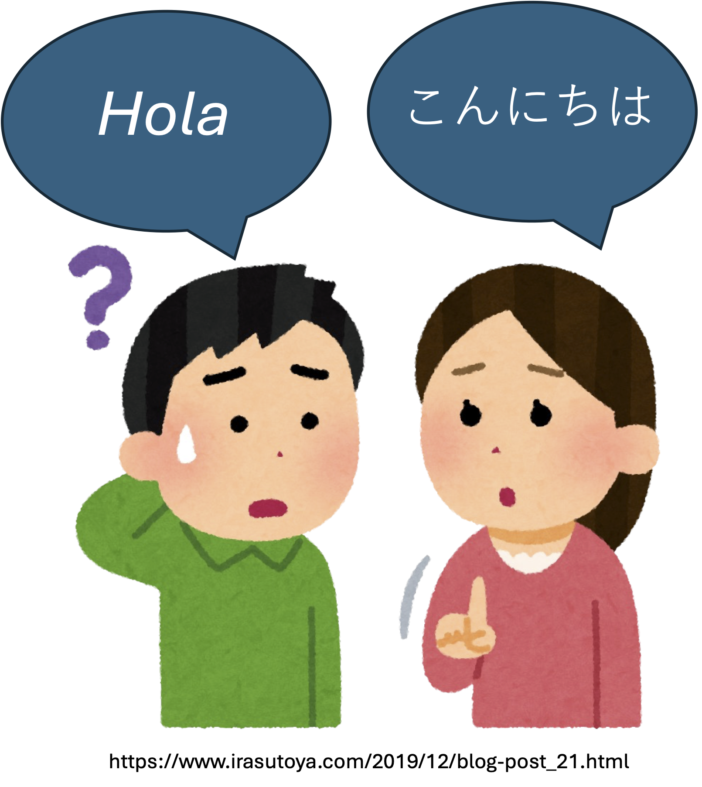{height="450"}
:::
:::

## 分類体系は生物学者の共通言語

::: {.columns}
::: {.column}

- 共通言語がないと、話が<br>通じない

- 分類体系は、**種についての「共通言語」**を与えて<br>くれる

:::
::: {.column}
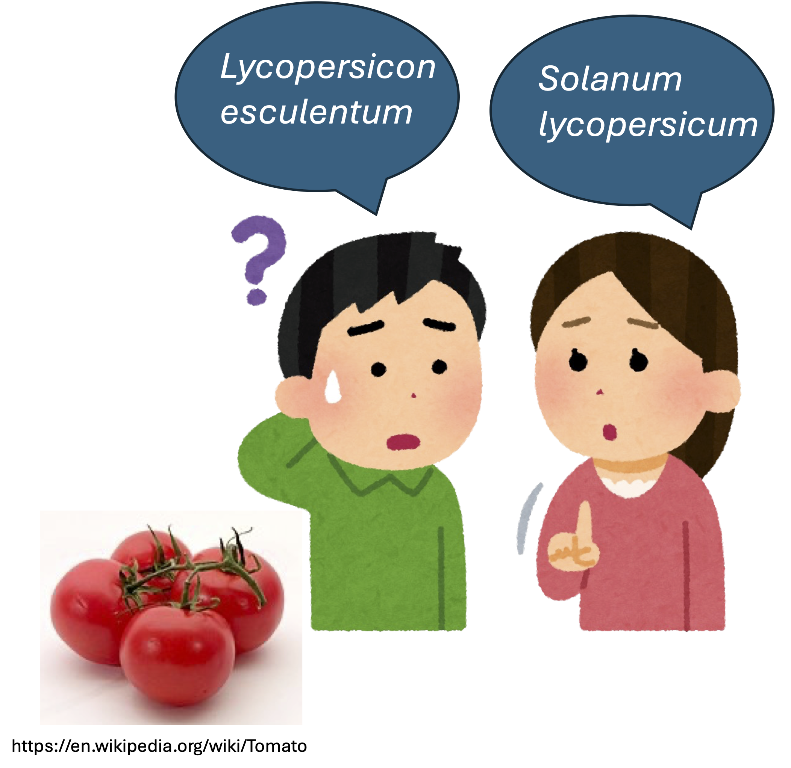{height="450"}
:::
:::

## 分類体系は生物学者の共通言語

:::::: {.incremental}

:::: {.columns}

::: {.column width="50%"}
- APG（Angiosperm Phylogeny Group）の分類体系は、とくに**被子植物**を扱う植物学者にとって重要

- では、**シダ植物**は？

:::

::: {.column width="50%"}
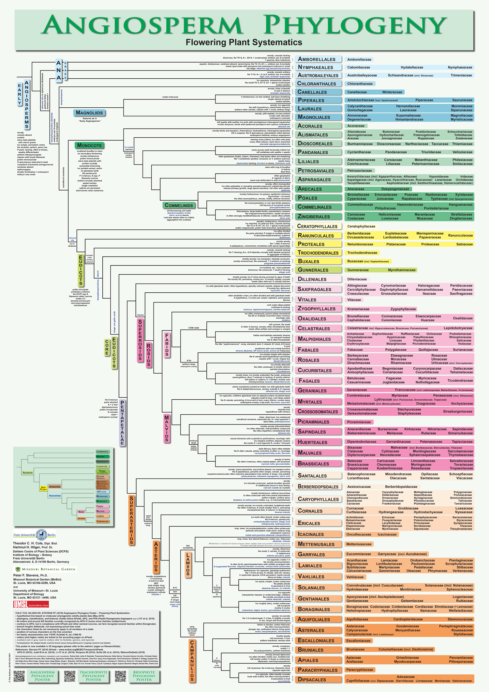{height="450"}
:::

::::

::::::

## 分類体系は生物学者の共通言語

:::: {.columns}

::: {.column width="50%"}
- APG（Angiosperm Phylogeny Group）の分類体系は、とくに**被子植物**を扱う植物学者にとって重要

- では、**シダ植物**は？

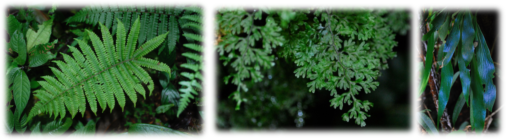{height="150"}
:::

::: {.column width="50%"}
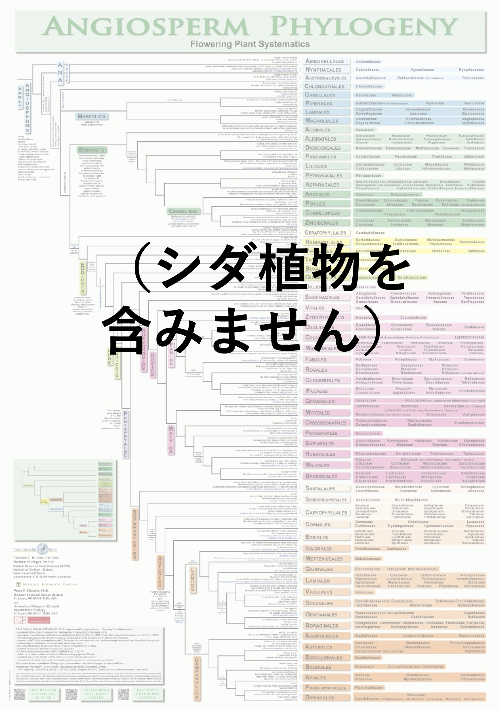{height="450"}
:::

::::

## シダ植物には PPG（Pteridophyte Phylogeny Group）がある

:::: {.columns}

::: {.column width="50%"}
- PPG は出発が遅かった
  - APG：1998年、主要アップデート4回
  - PPG：2016年、まだ**更新なし**
- コミュニティ主導
  - APG：著者13名
  - PPG：著者94名
:::

::: {.column width="50%"}
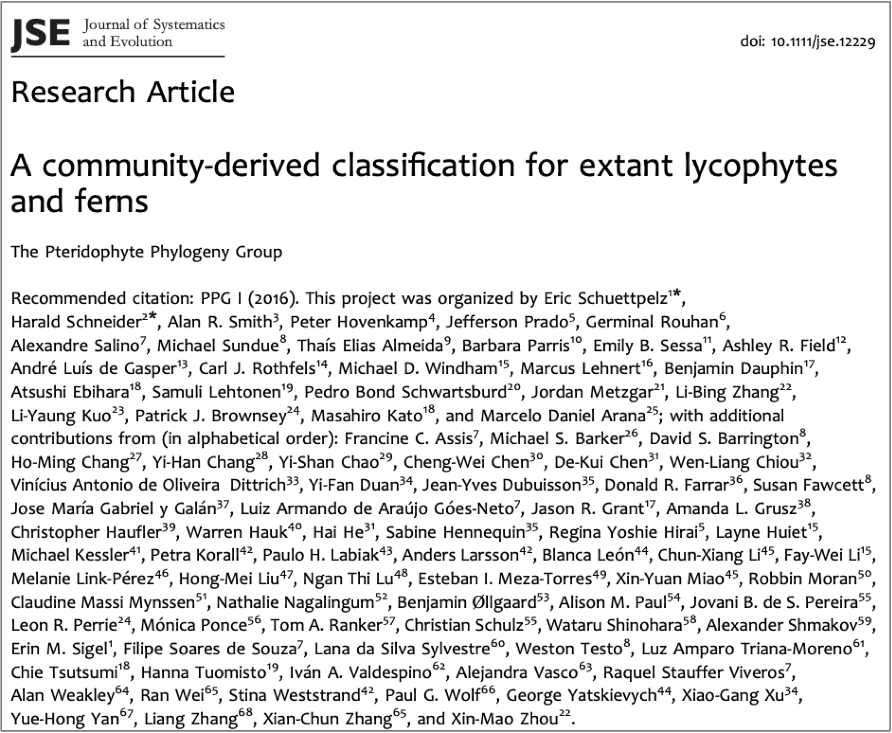{height="450"}
:::

::::

## PPG は系統に基づく {data-background-image="images/tree-back.png" data-background-size="auto 85%" data-background-position="right" style="width: 80%;"}

- 分類群を認識する一次基準は**単系統性**（monophyly）

## PPG は系統に基づく {data-background-image="images/tree-papers-back.png" data-background-size="auto 85%" data-background-position="right" style="width: 80%;"}

- 分類群を認識する一次基準は**単系統性**（monophyly）

- シダ植物の系統に関する現在の理解は、非常に多くの研究に支えられている

## PPG II に向けて

:::: {.columns}

::: {.column width="50%"}
- PPG Iが発表された2016年以降、属以上で**約80の新名**が公表された

- これらの名称を採用するかどうか、**議論を通して<br>決める必要がある**

- PPG II に向けた**属以上**の分類体系更新は2023年5月に開始（**「フェーズ1」**）
:::

::: {.column width="10%"}
:::


::: {.column width="40%"}
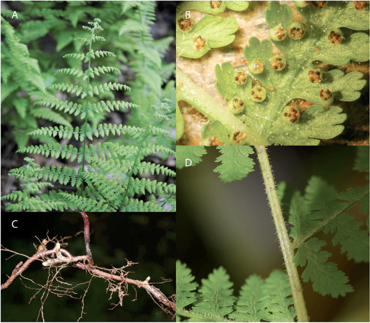{height="400"}


::: {style="font-size: 0.5em"}
親属 ***Sitobolium***（旧 *Dennstaedtia*）  
Triana-Morena et al. (2022)
:::

:::

::::

## PPG II のコミュニティ

```{r}
ppg2_authors <- read_csv("data/ppg2_author_list.csv")

n_auth <- ppg2_authors |>
  pull(name) |>
  n_distinct()

n_country <- ppg2_authors |>
  pull(country) |>
  n_distinct()

```

:::: {.columns}

::: {.column width="25%"}
- **`r n_country`** ヶ国から **`r n_auth`** 名の現役メンバー

- 運営委員会：5名

<br>
<br>

::: {style="font-size: 0.5em"}
第20回国際植物会議（2024年・スペイン・マドリッド）にて
:::

:::

::: {.column width="75%"}

```{r}
#| fig-height: 4
make_author_map(ppg2_authors)
```

{height="250"}

:::

::::

# PPG II フェーズ 1 {data-part="PPG II フェーズ1"}

## PPG II（フェーズ1）の新しい議論<br>プラットフォーム


:::: {.columns}

::: {.column width="60%"}
- PPG I では、議論の中心は**メール**
  - 公開されない
  - 記録が残らない
:::

::: {.column width="10%"}
:::

::: {.column width="30%"}
{height="150"}
:::

::::

## PPG II（フェーズ1）の新しい議論<br>プラットフォーム

:::: {.columns}

::: {.column width="60%"}
- PPG I では、議論の中心は**メール**
  - 公開されない
  - 記録が残らない

- PPG II では **GitHub** を使用
  - 議論をホストする機能が充実
  - 議論はすべて**公開**され、恒久的に閲覧できる
:::

::: {.column width="10%"}
:::

::: {.column width="30%"}
{height="150"}
{height="150"}
:::

::::

## 提案（Issue）一覧 <https://github.com/pteridogroup/ppg/issues>

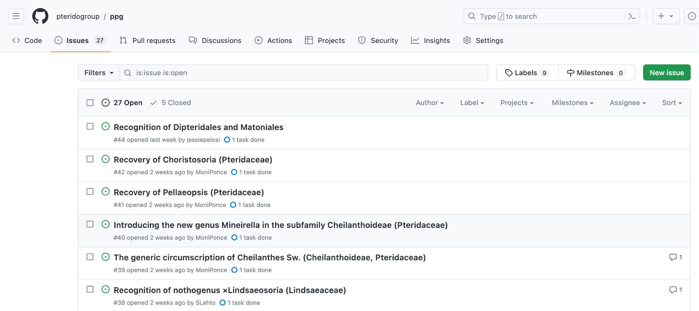{}

## 誰でも提案を提出できる
:::: {.columns}

::: {.column width="50%"}
- 提案の条件
  - **PPG I に対する変更**<br>であること
  - 国際藻類・菌類・植物命名規約（ICN）に基づき<br>**有効に公表されている**こと
:::

::: {.column width="50%"}
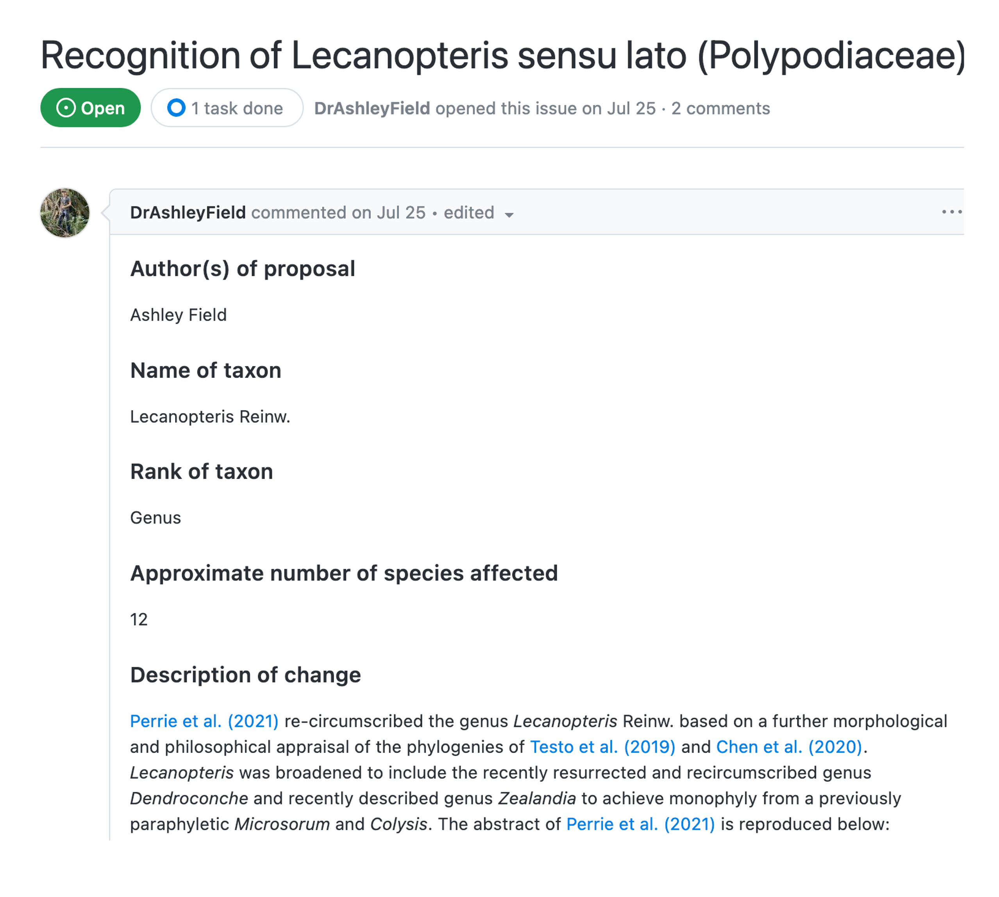
:::

::::

## 議論はすべて公開される

:::: {.columns}

::: {.column width="50%"}
- 誰でも閲覧・参加でき、記録は恒久的に残る
- 各提案には、投票前に少なくとも**1か月の議論期間**<br>がある
:::

::: {.column width="10%"}
:::

::: {.column width="40%"}
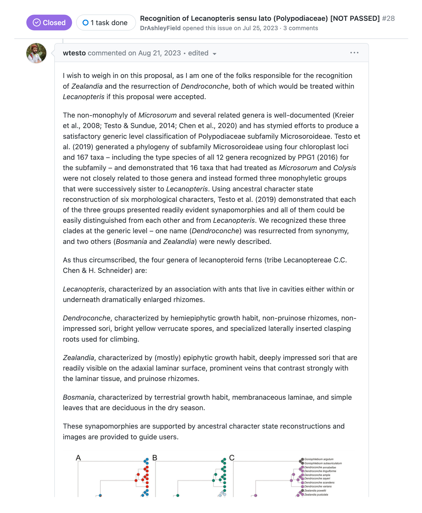
:::

::::

## 投票は Google Forms で実施
:::: {.columns}

::: {.column width="60%"}
- 可決には $2/3$ 以上の賛成が必要

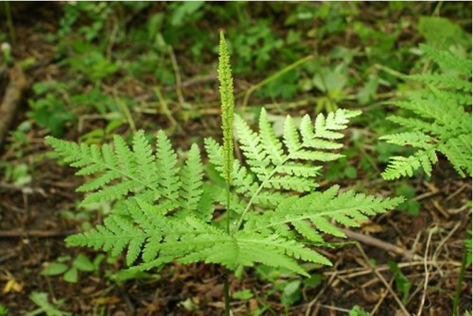{height="250"}

::: {style="font-size: 0.5em"}
親属 ***Sahashia***（旧 *Botrychium*）  
写真：V.S. Volkotrub <https://www.gbif.org/occurrence/2005351333>
:::

:::

::: {.column width="40%"}
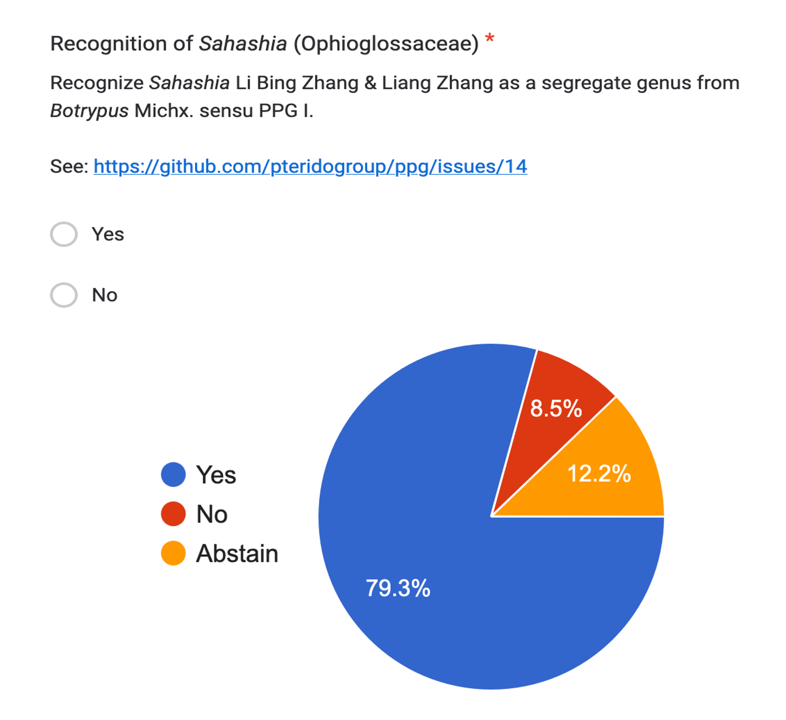{height="350"}
:::

::::

## 議論の目標を達成した

```{r}
ppg_issues <- read_csv("data/ppg_issues.csv")
make_issues_plot(ppg_issues)
```

2023年5月以降、提案 **79件** を受けて、議論し、投票を行った（目標：約80分類群）

## PPG II は完成された

:::: {.columns}

::: {.column width="50%"}
- *TAXON* に 2026年3月4日<br>**投稿済み**

- **`r n_country`** ヶ国を代表する<br>**`r n_auth`** 名の著者
:::

::: {.column width="50%"}
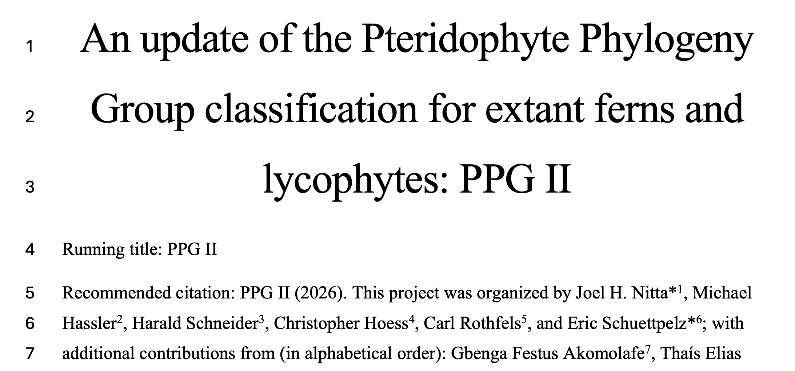{}  
...  
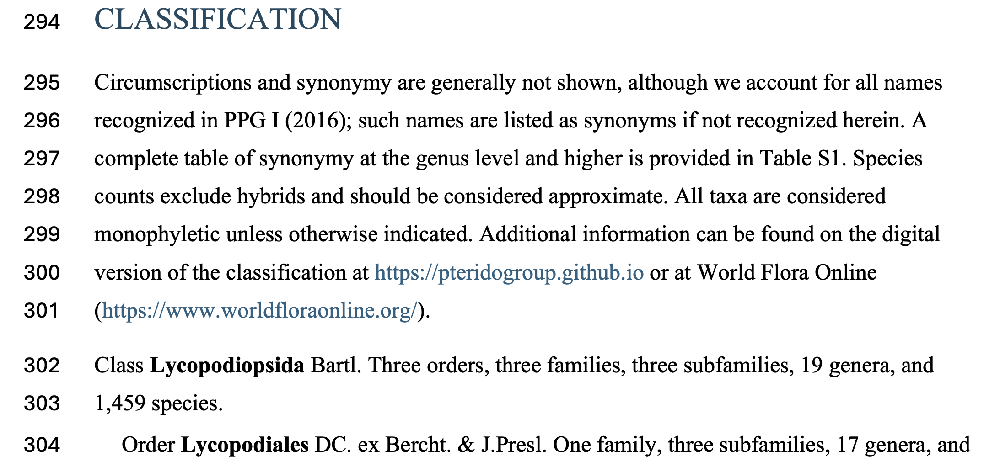{}
:::

::::

---

## PPG II 分類の概要

<br>

::: {style="font-size: 0.9em;"}

```{r}
read_csv("data/ppg_taxa_count.csv", show_col_types = FALSE) |>
  select(taxonRank, accepted, synonym, ppgi_accepted) |>
  filter_out(taxonRank %in% c("Tribe", "Nothogenus", "Species")) |>
  select(-synonym) |>
  mutate(
    ppgi_accepted = case_when(
      taxonRank == "Species" ~ "（扱っていない）",
      .default = ppgi_accepted
    )
  ) |>
  mutate(
    taxonRank = case_when(
      taxonRank == "Class" ~ "綱",
      taxonRank == "Subclass" ~ "亜綱",
      taxonRank == "Order" ~ "目",
      taxonRank == "Suborder" ~ "亜目",
      taxonRank == "Family" ~ "科",
      taxonRank == "Subfamily" ~ "亜科",
      taxonRank == "Tribe" ~ "族",
      taxonRank == "Genus" ~ "**属**",
      taxonRank == "Nothogenus" ~ "雑種属",
      taxonRank == "Species" ~ "種",
      TRUE ~ taxonRank
    )
  ) |>
  mutate(
    across(
      c(accepted, ppgi_accepted),
      ~ str_replace_all(.x, "not used", "（扱っていない）") |>
        str_remove_all("\\*|\\\\")
    )
  ) |>
  select(
    Rank = taxonRank,
    `PPG II` = accepted,
    `PPG I` = ppgi_accepted
  ) |>
  knitr::kable()
```

:::

# PPG II フェーズ 2 {data-part="PPG II フェーズ2"}

## フェーズ2：種レベルデータの<br>キュレーション

- PPG II は**種レベル**のデータも含む（PPG I は属以上のみ）

- 種数が多すぎて、**すべての変更を投票で決めるのは現実的ではない**

- PPG メンバーが**「Curator（キュレーター）」**として参加し、
  専門とする分類群（属または科）の種を維持・更新する

## PPG は WFO と連携してデータを管理

- [**World Flora Online（WFO）**](https://www.worldfloraonline.org/)は、全植物を対象とする**グローバルな分類学データベース**

- PPG は WFO 上でシダ植物のデータを管理している

- WFOには、分類学データベース編集ツール**「Rhakhis」** がある

{height="150"}

## Rhakhis による共同編集

- **分類学上のルール**を強制できる

- **クラウド型**なので、ファイルのやり取りが不要

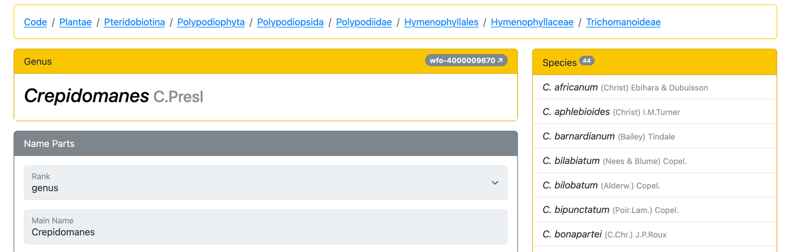{height="350"}

## オープンでコミュニティ主導の利点
:::: {.columns}

::: {.column width="50%"}
- データベースの更新をより高頻度で行える
  - また10年間を待つ必要はありません！
  - PPG 2.0.1, 2.0.2, など

- 多くの専門家で作業を分担でき、
  データの品質と最新性を保ちやすい
:::

::: {.column width="50%"}
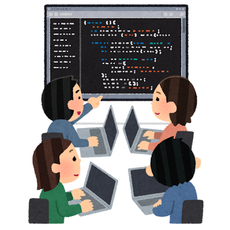{}
:::

::::

```{r}
# Load curator data
curators <- read_csv("data/curators.csv", show_col_types = FALSE)

curators_long <- curators |>
  select(genus, contains("curator")) |>
  pivot_longer(names_to = "num", values_to = "name", -genus)

n_curators <- curators_long |>
  filter_out(is.na(name)) |>
  pull(name) |>
  n_distinct()

gen_count <-
  curators_long |>
  group_by(genus) |>
  summarize(
    n = n_distinct(name, na.rm = TRUE)
  ) |>
  mutate(
    has_curator = case_when(
      n > 0 ~ "yes",
      .default = "no"
    )
  ) |>
  count(has_curator) %>%
  split(.$has_curator)

genera_coverage <- round(gen_count$yes$n / sum(gen_count$yes$n, gen_count$no$n) * 100, 1)
```

## 属の大多数にキュレーターが付いている

```{r}
make_curators_plot(curators)
```

2026年2月17日の開始以降、計 **`r n_curators` 名**のキュレーターのご参加により属の **`r genera_coverage`%** をカバー

## 今後の展開 {data-part="今後の展開"}

## PPG を参照できる場所

:::: {.columns}

::: {.column width="50%"}
- [World Flora Online](https://www.worldfloraonline.org/)
  - 年2回程度のスナップショット
:::

::: {.column width="50%"}
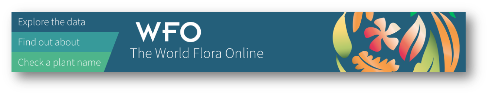{}
:::

::::

:::: {.columns}

::: {.column width="50%"}
- [PPG Website](https://pteridogroup.github.io/ppg.html)
  - より頻繁な更新
:::

::: {.column width="50%"}
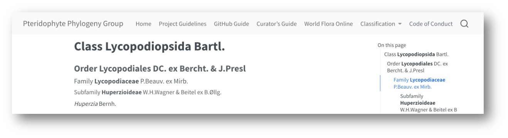{}
:::

::::

:::: {.columns}

::: {.column width="50%"}
- [Rhakhis](https://list.worldfloraonline.org/rhakhis/ui/index.html)
  - ライブデータ
:::

::: {.column width="50%"}
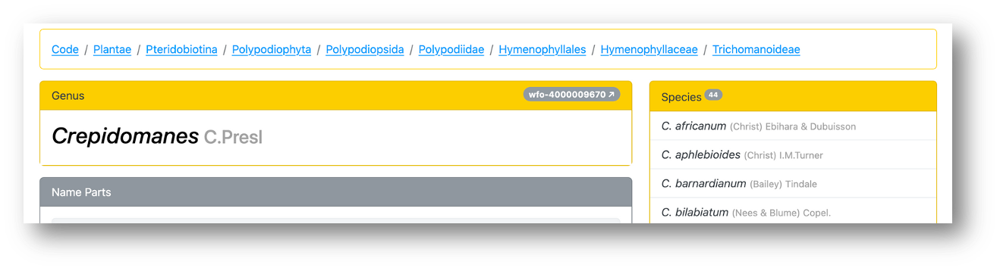{}
:::

::::

## まとめ

- PPG は、オープンで**協働的なアプローチ**で分類体系を構築している

- ここで紹介した方法により、PPG は系統分類学研究の進展に合わせて**頻繁に更新**を発行できるようになる

::: {style="border: 2px solid #333; padding: 20px; border-radius: 10px; background-color: #f9f9f9; font-size: 0.8em;"}

### 謝辞

:::: {.columns}

::: {.column width="50%"}
- Alan Elliott (WFO)
- Roger Hyam (WFO)
- 第20回国際植物会議の主催者
- 2025年 Botany 学会の主催者
:::

::: {.column width="50%"}
{height="210" style="margin-top: -30px; margin-left: 60px;"}
:::

::::

:::
